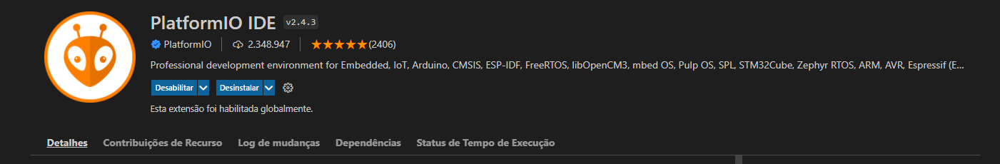

<h1 align="center">Potenciostato_Firmware</h1>

Projeto Potenciostato - um instrumento capaz de aplicar um potencial e medir a corrente resultante em um sistema eletroquímico. Desenvolvido no processador ESP32-WROOM. 

## 💻 Ambiente de desenvolvimento
O desenvolvimento deste projeto é realizado no ambiente VSCode, fazendo uso da extensão [PlatformIO](https://platformio.org/).
O PlatformIO é uma plataforma que facilita o desenvolvimento de sistemas embarcados.

## 💻 Configurações do ambiente (VSCode)

### 📥Versão VSCode

A versão usada do Visual Studio Code foi a V1.66.2. Você pode obtê-la em https://code.visualstudio.com/.

### 📥 Instalação do PlatformIO

PlatformIO IDE - **v3.3.1**
-Após baixar o VSCode no lado esquerdo em  **Extensões** pesquise **PlatformIO IDE** e baixe a IDE

### ⚙️ Configurando o Suporte da Espressif no PlatformIO

Para desenvolver para o ESP32, você precisa configurar o suporte da Espressif no PlatformIO. Siga os passos abaixo para fazer isso:

- Abra o PlatformIO no VSCode.
- Clique em "Home" na barra lateral esquerda.
- Na seção "Quick Access", clique em "Platforms".
- Pesquise por "Espressif 32" e clique em "Install".
- Após a instalação, você estará pronto para desenvolver para o ESP32.

### ▶️ Executar arquivo do projeto

Para abrir o projeto basta abrir **PlatformIO:Home** ir em  **Open Project** e abrir o arquivo do projeto **.ino** 

## 📂 Organização do Firmware
O firmware está sendo desenvolvido com a plataforma Arduino, o que facilita a programação e a organização do código. A IDE Arduino é capaz de lidar com o código do firmware de forma intuitiva e eficaz.

Esteja à vontade para explorar e contribuir para o desenvolvimento deste emocionante projeto de Potenciostato! Se você tem alguma dúvida ou sugestão, sinta-se à vontade para entrar em contato com a equipe de desenvolvimento. Juntos, podemos fazer grandes avanços na eletroquímica.
